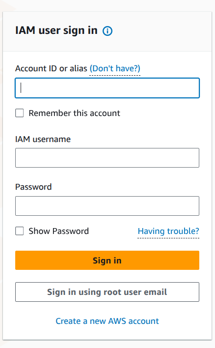
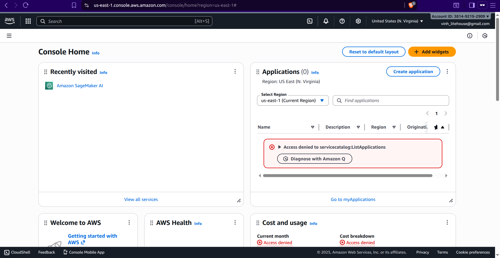

# Hướng dẫn thiết lập môi trường thực hành

## Bước 1: Truy cập AWS Management Console

Mở trình duyệt web và truy cập vào đường dẫn sau:

```
https://console.aws.amazon.com
```

## Bước 2: Đăng nhập vào Tài khoản AWS



Trong giao diện đăng nhập, điền các thông tin sau:

| Thông tin | Giá trị |
|-----------|--------|
| **Account ID** | `381492192909` |
| **IAM User** | `<thông tin được cung cấp cho bạn>` |
| **Password** | `<mật khẩu được cung cấp cho bạn>` |

> ⚠️ **Lưu ý:** Sử dụng thông tin đăng nhập IAM User và Password mà bạn đã nhận được từ Litehouse.

## Bước 3: Xác nhận Đăng nhập Thành công

Sau khi đăng nhập thành công, bạn sẽ được chuyển hướng đến AWS Management Console như hình dưới đây:



Tại đây, bạn có thể truy cập các dịch vụ AWS như Amazon SageMaker, AWS Bedrock, và những dịch vụ khác cần thiết cho bài thực hành.

---

✅ **Hoàn tất!** Bạn đã thiết lập xong môi trường để bắt đầu khóa học.

👉 **[Tiếp theo: Giới thiệu về RFM Analysis →](2.0.RFM_Intro.md)**
