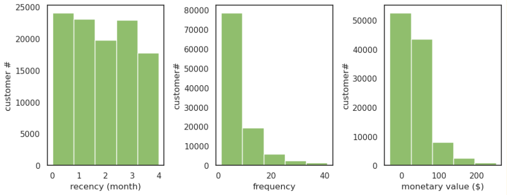

# 2.3.3. Tính toán Chỉ số RFM

## Giới thiệu về RFM Analysis

RFM (Recency, Frequency, Monetary) là một phương pháp phân tích khách hàng dựa trên ba chỉ số chính:

| Chỉ số | Định nghĩa | Ý nghĩa |
|--------|-----------|--------|
| **Recency (R)** | Khoảng thời gian kể từ lần mua cuối cùng | Khách hàng hoạt động gần đây hay không |
| **Frequency (F)** | Số lần khách hàng mua hàng | Khách hàng quay lại bao nhiêu lần |
| **Monetary (M)** | Tổng giá trị tiền mua hàng của khách hàng | Khách hàng chi tiêu bao nhiêu |

## Quy trình Tính toán RFM

### **Bước 1: Tính toán Recency (Tính gần đây)**

Xác định thời gian kể từ lần mua cuối cùng của khách hàng, lấy tháng 2 năm 2020 làm mốc tham chiếu:

```python
# Ánh xạ tháng sang điểm số (0 = gần nhất, 4 = lâu nhất)
d = {"Oct": 4, "Nov": 3, "Dec": 2, "Jan": 1, "Feb": 0}
df_sales.loc[:, 'Recency'] = df_sales['month'].map(d)

# Nhóm theo user_id và lấy giá trị Recency nhỏ nhất (gần nhất)
df_R = df_sales.groupby('user_id')['Recency'].min().reset_index().rename(columns={"0": "Recency"})
```

### **Bước 2: Tính toán Frequency (Tần suất)**

Đếm số lần khách hàng thực hiện giao dịch:

```python
# Nhóm theo user_id và đếm số lần mua hàng
df_F = df_sales.groupby('user_id')['event_type'].count().reset_index().rename(columns={"event_type": "Frequency"})
```

### **Bước 3: Tính toán Monetary (Giá trị Tiền)**

Tính tổng giá trị giao dịch của mỗi khách hàng:

```python
# Nhóm theo user_id và tính tổng giá trị mua hàng
df_M = df_sales.groupby('user_id')['price'].sum().reset_index().rename(columns={"price": "Monetary"})
```

### **Bước 4: Gộp các Chỉ số RFM**

Kết hợp ba bảng Recency, Frequency, và Monetary thành một bảng dữ liệu duy nhất:

```python
# Gộp Recency và Frequency
df_RF = pd.merge(df_R, df_F, on='user_id')

# Gộp với Monetary
df_RFM = pd.merge(df_RF, df_M, on='user_id')
```

### **Bước 5: Loại bỏ Outliers (Ngoại lệ)**

Trước khi áp dụng K-Means clustering, loại bỏ các giá trị ngoại lệ bằng phương pháp Z-score:

```python
# Tính Z-score: (giá trị - trung bình) / độ lệch chuẩn
# Giữ lại các giá trị có Z-score < 3
conditions = np.abs(stats.zscore(df_RFM.loc[:, ['Recency', 'Frequency', 'Monetary']])) < 3).all(axis=1)

# Tạo bảng dữ liệu đã loại bỏ outliers
df_RFM2 = df_RFM.loc[conditions, :]

# Hiển thị 5 dòng đầu tiên
df_RFM2.head(5)
```

## Kết quả

Bảng dữ liệu RFM sau khi tính toán và loại bỏ outliers:



Trong bảng kết quả, bạn có thể thấy:
- **user_id**: Mã định danh khách hàng
- **Recency**: Thời gian kể từ lần mua cuối cùng (0 = gần nhất)
- **Frequency**: Số lần khách hàng mua hàng
- **Monetary**: Tổng giá trị mua hàng

---

> 💡 **Mẹo:** Dữ liệu RFM này sẽ được sử dụng cho bước tiếp theo - **K-Means Clustering** để phân nhóm khách hàng thành các segment khác nhau.

👉 **[Tiếp theo: Biểu đồ Elbow →](2.7.SageMaker-elbow.md)**