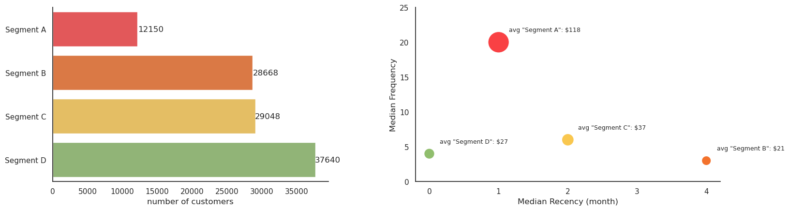

# Trực Quan Hóa 4 Cụm Khách Hàng

## Tổng Quan

Trong bước này, chúng ta sẽ tạo **2 biểu đồ trực quan hóa** để so sánh các segment khách hàng:

1. 📊 **Biểu Đồ Cột** - Số lượng khách hàng trong mỗi segment
2. 🔵 **Biểu Đồ Scatter** - RFM (Recency, Frequency, Monetary) của mỗi segment

---

## Phân Tích Chi Tiết 2 Biểu Đồ

### 1. Biểu Đồ Cột - Phân Bố Số Lượng Khách Hàng

#### Mục Đích
Biểu đồ cột thể hiện **tổng số lượng khách hàng** thuộc mỗi segment sau khi áp dụng thuật toán K-Means clustering. Đây là chỉ số quan trọng giúp chúng ta hiểu được quy mô tương đối của từng nhóm khách hàng.

#### Giải Thích Kết Quả
- **Trục hoành (X):** Tên các segment (Segment A, B, C, D)
- **Trục tung (Y):** Số lượng khách hàng
- **Độ cao cột:** Phản ánh mức độ tập trung của khách hàng trong mỗi segment

**Quy mô các segment:**
- **Segment A:** 12,150 khách hàng (14%)
- **Segment B:** 28,668 khách hàng (33%)
- **Segment C:** 29,048 khách hàng (34%)
- **Segment D:** 37,640 khách hàng (44%)

#### Ý Nghĩa Kinh Doanh
Sự khác biệt về quy mô giữa các segment giúp doanh nghiệp:
- **Ưu tiên chiến lược marketing:** Tập trung vào segment có số lượng khách hàng nhiều nhất
- **Phân bổ tài nguyên hợp lý:** Cân bằng giữa quy mô segment và giá trị khách hàng
- **Đánh giá hiệu quả phân cụm:** Một phân bổ cân bằng thường chỉ ra chất lượng clustering tốt

---

### 2. Biểu Đồ Scatter - Phân Tích RFM theo Segment

#### Mục Đích
Biểu đồ scatter (điểm) trực quan hóa **mối quan hệ ba chiều giữa ba chỉ số RFM** (Recency, Frequency, Monetary) của khách hàng trong từng segment. Mỗi điểm đại diện cho một khách hàng hoặc một segment.

#### Thành Phần Biểu Đồ
- **Trục hoành (X):** Recency (R) - Số ngày kể từ lần mua hàng cuối cùng
  - Giá trị thấp = Khách hàng mua hàng gần đây
  - Giá trị cao = Khách hàng không mua hàng lâu rồi

- **Trục tung (Y):** Frequency (F) - Tần suất mua hàng
  - Giá trị cao = Khách hàng mua hàng thường xuyên
  - Giá trị thấp = Khách hàng mua hàng ít lần

- **Kích thước điểm:** Monetary (M) - Tổng giá trị chi tiêu
  - Điểm lớn = Chi tiêu cao
  - Điểm nhỏ = Chi tiêu thấp

- **Màu sắc:** Phân biệt các segment khác nhau

#### Diễn Giải Các Nhóm Khách Hàng

**Segment A - Khách Hàng Giá Trị Cao (Best Customers):**
- **Quy mô:** 12,150 khách hàng (nhỏ nhất)
- **Đặc điểm RFM:** Recency ~1 tháng, Frequency ~20 lần, Monetary $118
- **Hành vi:** Mua gần đây, mua thường xuyên nhất, chi tiêu cao nhất
- **Giá trị:** Đóng góp cao nhất cho doanh thu (mặc dù số lượng nhỏ)
- **Chiến lược:** 
  - Giữ chân bằng VIP service, ưu đãi độc quyền
  - Chương trình loyalty cao cấp
  - Personalized marketing campaigns

**Segment B - Khách Hàng Tiềm Năng (At-Risk/High Value):**
- **Quy mô:** 28,668 khách hàng (34%)
- **Đặc điểm RFM:** Recency ~4 tháng, Frequency ~3 lần, Monetary $21
- **Hành vi:** Không mua gần đây, mua hiếm, chi tiêu vừa phải
- **Giá trị:** Tiềm năng cao nhưng đang mất động lực
- **Chiến lược:**
  - Tái kích hoạt (Reactivation campaigns)
  - Win-back offers, khuyến mãi đặc biệt
  - Survey để hiểu lý do giảm mua hàng

**Segment C - Khách Hàng Mới/Phát Triển (Developing):**
- **Quy mô:** 29,048 khách hàng (34%)
- **Đặc điểm RFM:** Recency ~2 tháng, Frequency ~6 lần, Monetary $37
- **Hành vi:** Mua gần đây, tần suất mua vừa phải, chi tiêu trung bình
- **Giá trị:** Tiềm năng phát triển trung bình
- **Chiến lược:**
  - Nâng cao tần suất mua (Cross-selling, Up-selling)
  - Bundle offers để tăng giá trị đơn hàng
  - Engagement campaigns

**Segment D - Khách Hàng Có Độ Trung Thành Cao (Loyal/Moderate):**
- **Quy mô:** 37,640 khách hàng (lớn nhất)
- **Đặc điểm RFM:** Recency ~0.5 tháng, Frequency ~4 lần, Monetary $27
- **Hành vi:** Mua gần đây, tần suất mua ổn định, chi tiêu vừa phải
- **Giá trị:** Cơ sở khách hàng trung thành lớn nhất
- **Chiến lược:**
  - Duy trì mối quan hệ đều đặn
  - Chương trình rewards để khuyến khích tần suất
  - Upsell để tăng giá trị từng khách hàng

#### Ưu Điểm Của Biểu Đồ Scatter RFM
- **Trực quan hóa đa chiều:** Thể hiện ba chỉ số quan trọng trong một biểu đồ duy nhất
- **Xác định pattern:** Dễ nhận diện các mẫu hành vi khách hàng
- **Hỗ trợ quyết định:** Cơ sở cho các chiến lược marketing, retention, churn prevention
- **So sánh segment:** Thấy rõ điểm khác biệt giữa các nhóm khách hàng

---

## Tổng Kết Phân Tích

Kết hợp cả hai biểu đồ giúp chúng ta có cái nhìn toàn diện về cấu trúc khách hàng:
1. **Biểu đồ cột** cho biết **quy mô** của từng segment
2. **Biểu đồ scatter RFM** cho biết **đặc điểm và giá trị** của từng segment

Từ đó, doanh nghiệp có thể xây dựng các chiến lược marketing, bán hàng, và dịch vụ khách hàng phù hợp cho từng nhóm, tối đa hóa lợi nhuận và tỷ lệ giữ chân khách hàng.

---

**Tiếp theo:** Lưu kết quả vào trong S3 [phần tiếp theo](2.10.SageMaker-end.md) 🎯

