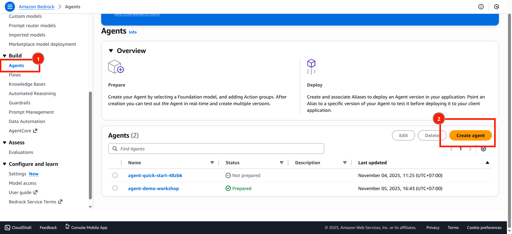
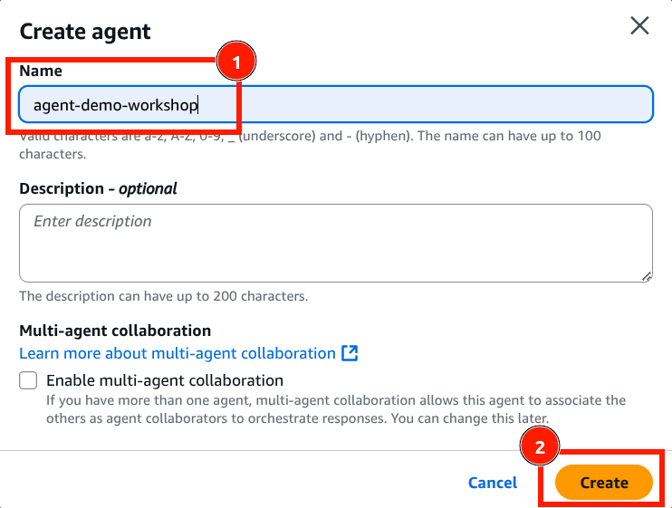

# Khởi Tạo AI Agent trên AWS Bedrock

## Tổng Quan

Trong bước này, chúng ta sẽ tạo một **AI Agent mới** trên AWS Bedrock Console. Agent này sẽ là nền tảng để xây dựng hệ thống gợi ý sản phẩm tự động cho các phân khúc khách hàng.

---

## Hướng Dẫn Chi Tiết Từng Bước

### **Bước 1️⃣: Truy Cập AWS Bedrock Console**

**Tìm Bedrock Service**
   ```
   Cách 1: Tìm kiếm trên thanh tìm kiếm
      • Click vào thanh Search (trên cùng)
      • Gõ "Bedrock"
      • Bấm Enter
   
   Cách 2: Từ Services dropdown
      • Bấm vào Services (trên cùng trái)
      • Tìm "Bedrock" trong danh sách
      • Click chọn
   ```
---

### **Bước 2️⃣: Tìm Menu Agents**

#### **Các Bước:**

1. **Tìm Phần "Build" trên Menu Trái**


2. **Click vào "Agents"**

3. **Xem Danh Sách Agents Hiện Có**
   ```
   Trên trang Agents sẽ hiển thị:
   • Danh sách các agents đã tạo
   • Thông tin: Name, Status, Created date
   • Nút "Create Agent" (nếu chưa có agent)
   ```

**Ảnh mô tả:**


---

### **Bước 3️⃣: Mở Giao Diện Khởi Tạo Agents**

1. **Giao Diện Create Agent Mở Ra**
   ```
   Bạn sẽ thấy form khởi tạo agent với các trường:
   • Agent name (text field)
   • Agent description (optional)
   • IAM role (dropdown)
   • Model selection (dropdown)
   • Other configurations
   ```
2. **Click vào "Agent Name"**
   ```
   Field "Agent name" sẽ được highlight
   Cursor nằm trong text box
   ```
3. **Nhập Tên Agent**
   ```
   Tên Agent: agent-demo-workshop
   
   📝 Gợi ý đặt tên:
      • Sử dụng lowercase
      • Sử dụng dấu gạch ngang (hyphen)
      • Tên mô tả chức năng
      • Ví dụ:
         - product-recommendation-agent
         - customer-segmentation-agent
         - rfm-analysis-agent
   ```
4. **Nhập Mô Tả (Optional)**
   ```
   Field: "Agent description"
   Ví dụ: "AI Agent for product recommendations based on RFM customer segmentation"
   
   💡 Lợi ích:
      • Giúp nhớ mục đích agent
      • Dễ tìm kiếm sau
      • Team members hiểu rõ
   ```
 
**Ảnh mô tả:**


---

### **Bước 4️⃣: Tạo Agent**

#### **Các Bước:**

1. **Kiểm Tra Lại Thông Tin**
   ```
   ✅ Trước khi bấm Create, kiểm tra:
      • Agent name: Nhập đủ
      • Description: (Optional) Nhập
      • IAM role: Chọn đúng
      • Model: Chọn phù hợp
   ```

2. **Bấm Nút "Create"**
   ```
   Bấm vào nút "Create" (góc dưới phải)
   Status: "Creating..."
   (Chờ vài giây)
   ```

3. **Chờ Agent Được Tạo**
   ```
   Thời gian: ~5-30 giây
   Màn hình sẽ loading...
   
   Sau khi hoàn tất:
   ✅ Giao diện Agent Builder sẽ mở ra
   ```

**Ảnh mô tả:**


---

**🎉 Xin chúc mừng! Bạn đã tạo thành công Agent đầu tiên trên AWS Bedrock!**

**Tiếp theo:** Cấu hình Knowledge Base [phần tiếp theo](3.2.Bedrock-knowledgebase.md)! 🚀