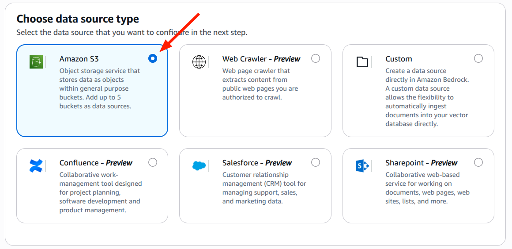
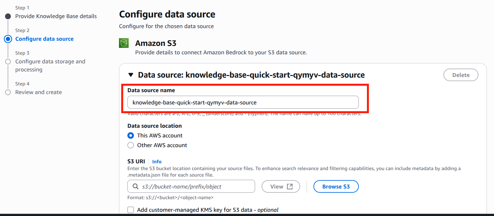
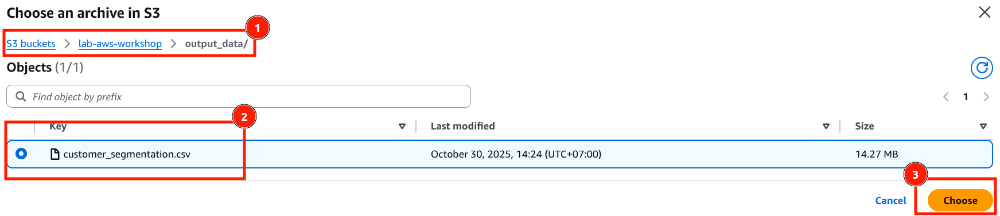
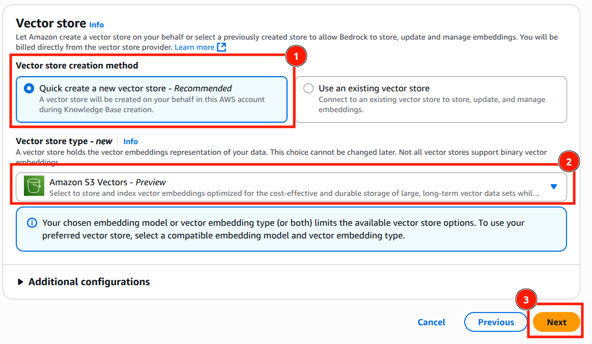

# Tạo Knowledge Base trên AWS Bedrock

## Tổng Quan

Trong bước này, chúng ta sẽ tạo **2 Knowledge Bases** để cung cấp dữ liệu cho AI Agent:

1. 📊 **Knowledge Base 1**: Dữ liệu phân khúc khách hàng (Customer Segmentation)
   - Dữ liệu: `customer_segmentation.csv` từ SageMaker
   - Vị trí S3: `s3://lab-aws-workshop/output_data/customer_segmentation.csv`

2. 📦 **Knowledge Base 2**: Dữ liệu sản phẩm (Product Catalog)
   - Dữ liệu: `sample_product_data.csv`
   - Vị trí S3: `s3://lab-aws-workshop/product_data/sample_product_data.csv`

---

## Hướng Dẫn Chi Tiết Tạo Knowledge Base

### **Bước 1️⃣: Truy Cập Knowledge Bases**

#### **Các Bước:**

1. **Vào Build → Knowledge Bases**

2. **Bấm "Create"**

3. **Chọn Knowledge Base with vector store**


---

### **Bước 2️⃣: Nhập Tên Cho Knowledge Base**

#### **Các Trường Cần Điền:**

1. **Knowledge Base Name**
   ```
   Field: "Knowledge Base name"
   Nhập: "customer-segmentation-kb"
   
   📝 Gợi ý:
      • Sử dụng lowercase
      • Sử dụng dấu gạch ngang (hyphen)
      • Tên mô tả rõ nội dung
      • Ví dụ:
         - customer-segmentation-kb
         - rfm-analysis-kb
         - product-catalog-kb
   ```


---

### **Bước 3️⃣: Cấu hình Role**

**Chọn "Create and use a new service role"**


---

### **Bước 4️⃣: Chọn Data Source**

#### **Các Bước:**

1. **Chọn Amazon S3**


2. **Bấm "Next"**

---

### **Bước 5️⃣: Configure Data Source**

#### **Các Bước:**

1. **Nhập Tên Data Source**
   ```
   Field: "Data source name"
   Nhập: "customer-segmentation-source"
   
   Ví dụ:
      - customer-segmentation-source
      - rfm-data-source
      - product-catalog-source
   ```
   

3. **Chọn S3 Bucket**
   ```
   Trong phần: "S3 URI"
   Bấm: "Browse S3"
   
   Tìm: "lab-aws-workshop"
   Chọn bucket này và tìm đến file: s3://lab-aws-workshop/output_data/customer_segmentation.csv
   ```
   

---

### **Bước 6️⃣: Cấu Hình Parsing và Chunking**

1. **Parsing Strategy**
   ```
   AWS Bedrock hỗ trợ nhiều lựa chọn parsing dữ liệu khác nhau: 
   - Amazon Bedrock default parser
   - Amazon Bedrock Data Automation as parser
   - Foundation models as a parser
   Trong bài lab này sử dụng parser mặc định của AWS Bedrock là "Amazon Bedrock default parser"
   ```
    

2. **Chunking Strategy**
   ```
   Có nhiều lựa chọn chunking dữ liệu trong AWS Bedrock.
   Trong bài lab này sử dụng default chunking.
   ```
    

3. **Tham khảo chi tiết hơn kiến thức về phần Parsing và Chunking tại**  ***[đây]([thamkhao].parsing_chunking.md)***
---

### **Bước 7️⃣: Configure Data Storage and Processing**
1. **Embeddings Model**
    ```
    - Trong phần Embeddings Model, chọn "Select model"
    - Chọn model Titan Text Embeddings V2
    - Bấm "Apply"
    ```
    
    

2. **Vector store**
    ```
    - Chọn "Quick create a new vector store"
    - Trong Vector store type, chọn "Amazon S3 Vectors"
    - Nhấn "Next"
    ```
    

    ***Chi tiết hơn kiến thức về Vector Store có thể tham khảo tại [đây]([thamkhao].vector_store.md)***
---

### **Bước 8️⃣: Review phần Knowledge Base**

**Xem lại một lượt các cấu hình cho phần knowledge base vừa tạo để tránh sai sót:**


**Bấm "Create Knowledge Base" và đợi 1-2 phút để tạo knowledge base**

---

## Tạo Knowledge Base Thứ 2 (Product Data)

### **Quy Trình Tương Tự**

Thực hiện các bước từ 1️⃣ đến 1️⃣2️⃣ với các thông tin sau:

#### **Thông Tin Knowledge Base 2:**

```
Knowledge Base Name:
  product-catalog-kb

Description:
  Knowledge base for product catalog and recommendations

Data Source:
  • Name: product-catalog-source
  • S3 Location: s3://lab-aws-workshop/product_data/sample_product_data.csv

File Details:
  • File: sample_product_data.csv
  • Format: CSV
  • Content: Product catalog, features, benefits, pricing

Embedding Model:
  Titan Embeddings V2

Vector Database:
  S3 vector database
```

---

## Kết Quả Cuối Cùng

### **2 Knowledge Bases Được Tạo**


#### **Knowledge Base 1️⃣: Customer Segmentation**
```
Name: customer-segmentation-kb
Status: ✅ Ready
Data: RFM segments, customer metrics
Source: s3://lab-aws-workshop/output_data/customer_segmentation.csv
Records: 4 segments (Loyal, Potential, New, At-Risk)
```

#### **Knowledge Base 2️⃣: Product Catalog**
```
Name: product-catalog-kb
Status: ✅ Ready
Data: Product information, features, pricing
Source: s3://lab-aws-workshop/product_data/sample_product_data.csv
Records: ~100-500 products
```

---

**🎉 Xin chúc mừng! Bạn đã tạo 2 Knowledge Bases sẵn sàng cho AI Agent!**

**Tiếp theo:** Cấu hình chi tiết cho AI Agent! 🚀