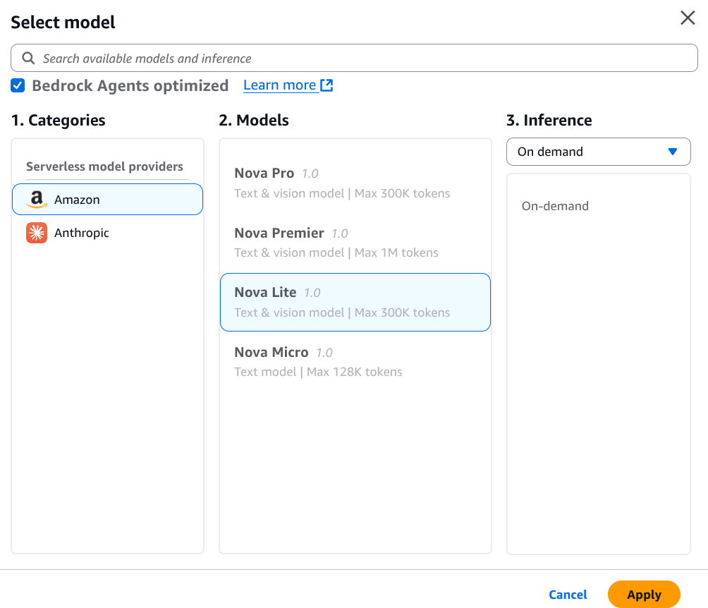
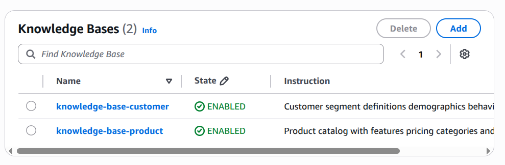

# Cấu Hình Chi Tiết AI Agent trên AWS Bedrock

## Tổng Quan

Ở phần trước, đã tạo thành công **2 Knowledge Bases**. Sang phần này, chúng ta sẽ cấu hình chi tiết các tính năng cho AI Agent để tạo thành một **Agent cơ bản hoàn chỉnh**.

### **Các Tính Năng Sẽ Cấu Hình:**

1. ✅ **Agent Role** - IAM role cho phép Agent thực hiện hành động
2. ✅ **Model LLM** - Chọn mô hình AI phù hợp
3. ✅ **Instructions** - Hướng dẫn hành vi Agent
4. ✅ **Knowledge Bases** - Kết nối 2 Knowledge Bases
5. ✅ **Guardrails** - Bảo vệ Agent khỏi xử lý không an toàn
6. ✅ **Action groups** - Cấu hình các Tools/Actions mà Agent có thể gọi

---

## Hướng Dẫn Chi Tiết Từng Cấu Hình

### **Bước 0️⃣: Vào Agent Builder**

#### **Các Bước:**

1. **Truy Cập AWS Bedrock Console**
   ```
   URL: https://console.aws.amazon.com/bedrock
   Menu: Build → Agents
   ```

2. **Chọn Agent Vừa Tạo**
   ```
   Tìm: "agent-demo-workshop"
   Click vào agent này
   ```

3. **Bấm "Edit in Agent Builder"**
   ```
   Nút: "Edit in Agent Builder" (góc phải trên)
   Hoặc: Vào chi tiết agent → Tab "Edit"
   
   Giao diện Agent Builder sẽ mở ra
   ```

4. **Giao Diện Agent Builder**
   ```
   Hiển thị:
   • Agent name ở trên cùng
   • Menu bên trái (Settings, Instructions, ...)
   • Main content area (Edit fields)
   • Save button (góc phải trên)
   ```

---

## 1️⃣ Cấu Hình Agent Role

### **Agent Role Là Gì?**

**Định nghĩa:**
```
Agent Role = IAM Role cho phép Agent thực hiện actions
• Truy cập S3 buckets
• Gọi Lambda functions
• Truy cập databases
• Gửi emails
• Cập nhật records
```

**Tại Sao Cần?**
```
✅ Security: Kiểm soát quyền của Agent
✅ Isolation: Agent chỉ có quyền cần thiết
✅ Audit: Theo dõi Agent actions
✅ Governance: Tuân thủ policies
```

### **Hướng Dẫn Cấu Hình Role**


#### **Các Bước:**

1. **Vào Settings Tab**
   ```
   Menu trái: Settings (hoặc Overview)
   Hoặc: Tìm section "Agent configuration"
   ```

2. **Tìm Field "IAM Role" (hoặc "Agent Execution Role")**
   ```
   Field: "IAM role for agent execution"
   Hiện tại: [Default role hoặc không chọn]
   ```

3. **Bấm Dropdown hoặc "Change Role"**
   ```
   Nút: Dropdown "Select IAM role"
   Danh sách role sẽ hiện ra
   ```

4. **Tìm Và Chọn Role Chính Xác**
   ```
   Tìm: "AmazonBedrockExecutionRoleForAgents_CSZ8RZ6GK66"
   
   Hoặc:
   • AmazonBedrockExecutionRole*
   • BedrockAgent*
   • Bất kỳ role có "Bedrock" trong tên
   
   Click chọn role này
   ```

---

## 2️⃣ Cấu Hình Model LLM

### **Model LLM Là Gì?**

**Định nghĩa:**
```
Model LLM = Large Language Model là "bộ não" của Agent
• Claude 3.5 Sonnet: Reasoning tốt, chậm hơn
• Claude 3 Haiku: Nhanh, chi phí thấp
• Llama 2: Open-source, tốc độ tốt
• Nova Lite: Nhanh, tối ưu cost (Khuyên dùng)
• Nova Pro: Mạnh hơn Nova Lite
```

### **So Sánh Các Model**

| Model | Speed | Quality | Cost | Best For |
|-------|-------|---------|------|----------|
| **Nova Lite** | ⚡⚡⚡ | ⭐⭐⭐ | $ | Simple tasks |
| **Nova Pro** | ⚡⚡ | ⭐⭐⭐⭐ | $$ | Balanced |
| **Claude 3.5 Sonnet** | ⚡ | ⭐⭐⭐⭐⭐ | $$$ | Complex reasoning |
| **Claude 3 Haiku** | ⚡⚡ | ⭐⭐⭐ | $ | Budget-friendly |

**Khuyến nghị cho Lab:** **Nova Lite** (tốc độ, chi phí, đủ tốt)

### **Hướng Dẫn Cấu Hình Model**



#### **Các Bước:**

1. **Vào Settings Tab**
   ```
   Menu trái: Settings (hoặc Model selection)
   Tìm: "Model configuration" section
   ```

2. **Tìm Field "Model"**
   ```
   Field: "Select LLM model" hoặc "Model"
   Hiện tại: [Model được chọn]
   ```

3. **Bấm Dropdown**
   ```
   Nút: Dropdown "Change model" hoặc "Select model"
   Danh sách model sẽ hiện ra
   ```

4. **Chọn Model Nova Lite**
   ```
   Tìm: "us.amazon.nova-lite" 
   Hoặc: "Nova Lite" trong danh sách
   
   Đầy đủ name có thể:
   • amazon.nova-lite-v1:0
   • us.amazon.nova-lite-v1:0
   • us.amazon.nova-lite
   
   Click chọn model này
   ```

5. **Kiểm Tra Model Configuration**
   ```
   Hiển thị:
   • Model Name: Nova Lite
   • Provider: Amazon
   • Status: ✓ Available
   • Max input tokens: [n]
   • Max output tokens: [m]
   
   ✅ Xác nhận: Model được chọn
   ```

---

## 3️⃣ Cấu Hình Instructions for the Agent

### **Instructions Là Gì?**

**Định nghĩa:**
```
Instructions = System prompt cho Agent
• Hướng dẫn cách hoạt động
• Constraints & rules
• Output format
• Personality & tone
• Examples
```

**Tại Sao Cần?**
```
✅ Behavior: Định hình cách Agent hoạt động
✅ Quality: Output phù hợp với yêu cầu
✅ Consistency: Kết quả nhất quán
✅ Safety: Giới hạn những gì Agent làm
✅ Context: Cung cấp background information
```

### **Hướng Dẫn Cấu Hình Instructions**


#### **Các Bước:**

1. **Vào Instructions Tab**
   ```
   Menu trái: Instructions
   Hoặc: Tìm "Agent Instructions" section
   ```

2. **Tìm Field "Instructions" hoặc "System Prompt"**
   ```
   Field: Large text area
   Hiện tại: [Default text hoặc trống]
   ```

3. **Click vào Text Area để Edit**
   ```
   Text area sẽ focus
   Cursor nằm trong
   Có thể type/paste
   ```

4. **Viết Instructions Cho Agent**
   ```
   You are a product recommendation agent with access to two knowledge bases:

   KNOWLEDGE BASE 1 - Customer Segmentation KB:
   - Contains: Customer segment definitions, demographics, behaviors, purchase patterns, preferences
   - Use when: You need to understand customer segments and their characteristics
   - Query first: Always start by retrieving all customer segments from this KB

   KNOWLEDGE BASE 2 - Product Catalog KB:
   - Contains: Product information, features, pricing, categories, specifications, availability
   - Use when: You need product details to match with customer segments
   - Query second: After understanding segments, find matching products from this KB

   ACTION TOOLS AVAILABLE:
   - save_s3: MUST be used to save recommendation results to S3

   WORKFLOW:
   Step 1: Query Customer Segmentation KB to get all segments
   Step 2: For each segment, analyze their characteristics
   Step 3: Query Product Catalog KB to find suitable products for each segment
   Step 4: Match products to segments based on demographics, preferences, and behaviors
   Step 5: Format output as JSON
   Step 6: Explain the reason why you do that
   Step 7: Display results to the user on chat (DO NOT save to S3 unless explicitly asked)

   SAVING TO S3 - OPTIONAL:
   - Only call save_s3 when user explicitly asks to "save results to S3" or "save to S3" or "save analysis"
   - Do NOT automatically save to S3 after analysis
   - When user asks to save, call the save_s3 function and confirm with the S3 path

   KNOWLEDGE BASE USAGE:
   - Use "knowledge-base-customer" to understand WHO the customers are (segments, demographics, behaviors, preferences)
   - Use "knowledge-base-product" to understand WHAT products are available (features, pricing, categories, target audience)
   - Cross-reference information from both KBs to create optimal matches

   When the user asks to save results to S3, you must:
   1. First, perform the customer segment analysis (if not already done)
   2. Then, call the "save_s3" action with the analysis results
   3. Pass the analysis as a JSON string in the "analysis_result" parameter
   4. After save succeeds, confirm to user with the S3 path

   IMPORTANT:
   - Never save to S3 automatically or proactively
   - Wait for explicit user request to save (e.g., "save to S3", "save results", "save this analysis")
   - Display analysis results on chat first, then save only when requested
   ```

---

## 4️⃣ Cấu Hình Knowledge Bases

### **Knowledge Bases Là Gì?**

**Định nghĩa:**
```
Knowledge Bases = Dữ liệu mà Agent có thể truy cập & sử dụng
• RAG (Retrieval Augmented Generation)
• Vector similarity search
• Context for better answers
```

**Tại Sao Cần?**
```
✅ Data: Cung cấp dữ liệu thực cho Agent
✅ Accuracy: LLM có thể tham chiếu dữ liệu
✅ Context: Giảm hallucinations
✅ Freshness: Dễ update dữ liệu
```

### **2 Knowledge Bases Cần Kết Nối**

```
1️⃣ Customer Segmentation KB
   • Name: knowledge-base-customer
   • Data: RFM segments, customer metrics
   • Usage: Phân tích nhóm khách hàng
   
2️⃣ Product Catalog KB
   • Name: knowledge-base-product
   • Data: Product info, features, pricing
   • Usage: Gợi ý sản phẩm
```

### **Hướng Dẫn Cấu Hình Knowledge Bases**



#### **Các Bước:**

1. **Vào Knowledge Bases Tab**
   ```
   Menu trái: Knowledge bases
   Hoặc: Tìm "Add Knowledge Base" section
   ```

2. **Bấm "Add Knowledge Base"**
   ```
   Nút: "Add Knowledge Base" hoặc "Add"
   Dialog/dropdown sẽ mở ra
   ```

3. **Chọn Knowledge Base Đầu Tiên**
   ```
   Danh sách KB sẽ hiện ra
   
   Chọn: "customer-segmentation-kb"
   • Hiển thị: KB name, created date
   • Status: Ready ✓
   
   Click chọn KB này
   ```

4. **Kiểm Tra KB 1 Được Thêm**
   ```
   Hiển thị:
   • KB Name: customer-segmentation-kb
   • Status: ✓ Connected
   • Data Source: 1
   • Vectors: Indexed
   
   ✅ Xác nhận: KB được thêm
   ```

5. **Bấm "Add Knowledge Base" Lần 2**
   ```
   Nút: "Add Knowledge Base" hoặc "Add"
   Dialog sẽ mở ra lần 2
   ```

6. **Chọn Knowledge Base Thứ 2**
   ```
   Danh sách KB sẽ hiện ra
   
   Chọn: "product-catalog-kb"
   • Hiển thị: KB name, created date
   • Status: Ready ✓
   
   Click chọn KB này
   ```

7. **Kiểm Tra KB 2 Được Thêm**
   ```
   Hiển thị:
   • KB 1: customer-segmentation-kb ✓
   • KB 2: product-catalog-kb ✓
   
   ✅ Xác nhận: Cả 2 KB được kết nối
   ```

---

## 5️⃣ Cấu Hình Guardrails


### **Guardrails Là Gì?**

**Định nghĩa:**
```
Guardrails = Bảo vệ an toàn cho Agent
• Content filtering
• Jailbreak prevention
• PII (Personally Identifiable Info) protection
• Harmful content detection
• Policy enforcement
```

### **Các Loại Guardrails**

```
1️⃣ Content Filtering
   • Ngôn ngữ không thích hợp
   • Tội phạm/bạo lực
   • Hate speech
   • Adult content

2️⃣ PII Protection
   • Không tiết lộ email
   • Không tiết lộ phone numbers
   • Không tiết lộ SSN
   • Không tiết lộ credit cards

3️⃣ Custom Policies
   • Company-specific rules
   • Industry regulations
   • Business logic
   • Custom constraints

4️⃣ Harmful Content Detection
   • Phishing attempts
   • Malware distribution
   • Scams
   • Misinformation
```

---

## 6️⃣ Cấu Hình Action Groups (Tools)

### **Action Groups Là Gì?**

**Định nghĩa:**
```
Action Groups = Tập hợp các Tools/Actions mà Agent có thể gọi
• Lambda functions
• API integrations
• Database queries
• External services
• Custom logic
```

### **So Sánh: Không Có vs Có Action Groups**

**❌ Không Có Action Groups:**
```
User: "Gửi email khuyến nghị cho customer 123"

Agent: "Dựa trên dữ liệu, tôi khuyên gửi email như sau:
  Subject: Recommended Products
  Body: ...
  
  (Chỉ tạo draft text, không thực sự gửi)"
```

**✅ Có Action Groups:**
```
User: "Gửi email khuyến nghị cho customer 123"

Agent: 
  1. Lấy customer profile (Tool: GetCustomerProfile)
  2. Lấy recommended products (Tool: GetRecommendations)
  3. Soạn email (LLM generates content)
  4. Gửi email (Tool: SendEmail)
  5. Cập nhật tracking (Tool: UpdateTracking)
  
  → Email thực sự được gửi!
```

### **Action Groups Architecture**

```
┌─────────────────────────────────────────┐
│         AI Agent (LLM)                  │
│  "Gợi ý sản phẩm cho customer 123"     │
└────────────────┬────────────────────────┘
                 │
                 ▼
     ┌───────────────────────┐
     │  Action Groups        │
     │  (Orchestrator)       │
     └───┬───┬───┬───┬───┬───┘
         │   │   │   │   │
    ┌────▼┐┌─▼───┐┌──▼──┐┌─▼────┐┌─▼────┐
    │Get  ││Get  ││Send ││Update││Log   │
    │Cust ││Recom││Email││Cust  ││Inter │
    │Data ││mend ││     ││Profile││action
    └────┬┘└──┬──┘└──┬──┘└──┬───┘└──┬───┘
         │    │      │      │      │
         ▼    ▼      ▼      ▼      ▼
       [Database] [API] [Email] [CRM]
```

### **Hướng Dẫn Cấu Hình Action Groups**

#### **Bước 1: Vào Action Groups Tab**

```
Menu trái: Action Groups (hoặc Tools)
Hoặc: Tìm "Add Action Group" section

Hiển thị:
• Danh sách action groups hiện có (nếu có)
• Nút "Add Action Group" hoặc "Create Action Group"
```

#### **Bước 2: Bấm "Add Action Group"**

```
Nút: "Add Action Group" (góc phải trên)
Hoặc: Nút "Create" 

Dialog/form sẽ mở ra
```

#### **Bước 3: Nhập Thông Tin Action Group**

```
Field 1: Action Group Name
   Nhập: "customer-recommendations-tools"
   
   Gợi ý:
   • Tên rõ ràng, mô tả chức năng
   • Format: kebab-case (dấu gạch ngang)
   • Ví dụ:
      - customer-data-tools
      - product-recommendation-tools
      - email-campaign-tools

Field 2: Description (Optional)
   Nhập: "Tools for retrieving customer data and product recommendations"
   
   Lợi ích:
   • Giúp nhớ mục đích
   • Team members hiểu rõ
   • Dễ maintain

Field 3: Action Group Type
   Chọn: "Lambda function" hoặc "API" hoặc "OpenAPI schema"
   
   Lựa chọn:
   • Lambda: AWS Lambda functions
   • API: REST API endpoints
   • OpenAPI: OpenAPI/Swagger definition
```

#### **Bước 4: Định Nghĩa Actions (Tools)**

Tùy theo loại, có 2 cách chính:

**Cách A: Lambda Functions**

```
Field 1: Lambda Function Name
   Nhập: "get-customer-profile"
   
   Lambda ARN: arn:aws:lambda:us-east-1:ACCOUNT:function:get-customer-profile

Field 2: Function Input Schema (JSON)
   ```json
   {
     "type": "object",
     "properties": {
       "customer_id": {
         "type": "string",
         "description": "Customer ID"
       },
       "include_history": {
         "type": "boolean",
         "description": "Include purchase history"
       }
     },
     "required": ["customer_id"]
   }
   ```

Field 3: Function Output Description
   Nhập: "Returns customer profile including name, email, RFM segment, and purchase history"

Field 4: IAM Role Permissions
   ✅ Lambda execution role cần:
      • lambda:InvokeFunction
      • bedrock:InvokeAgent
```

**Cách B: API Endpoints**

```
Field 1: API Name
   Nhập: "product-recommendation-api"

Field 2: API Endpoint
   Nhập: "https://api.example.com/products/recommend"

Field 3: HTTP Method
   Chọn: POST, GET, PUT

Field 4: Request Schema
   ```json
   {
     "type": "object",
     "properties": {
       "customer_segment": {
         "type": "string",
         "description": "Customer RFM segment"
       },
       "limit": {
         "type": "integer",
         "description": "Number of recommendations"
       }
     },
     "required": ["customer_segment"]
   }
   ```

Field 5: Response Schema
   ```json
   {
     "type": "object",
     "properties": {
       "recommendations": {
         "type": "array",
         "items": {
           "type": "object",
           "properties": {
             "product_id": {"type": "string"},
             "name": {"type": "string"},
             "score": {"type": "number"}
           }
         }
       }
     }
   }
   ```

Field 6: Authentication (Optional)
   Chọn: None, API Key, OAuth2, Basic Auth
```

#### **Bước 5: Thêm Nhiều Actions (Tools) Nếu Cần**

```
Bấm: "Add another action" hoặc "Add action"
Lặp lại Bước 4 cho mỗi tool

Ví dụ tạo 3 actions:
1. GetCustomerProfile
2. GetProductRecommendations
3. SendEmail
```

#### **Bước 6: Kiểm Tra Action Group Configuration**

```
Checklist:
☐ Action Group Name: ✓ Nhập
☐ Description: ✓ Nhập (optional)
☐ Actions defined: ✓ Ít nhất 1
☐ Input schema: ✓ Valid JSON
☐ Output schema: ✓ Valid JSON
☐ IAM permissions: ✓ Checked
☐ API endpoints: ✓ Accessible
```

#### **Bước 7: Lưu Action Group**

```
Nút: "Create Action Group" hoặc "Save"
Status: "Creating..."
Chờ vài giây

Xác nhận:
✅ Action group được tạo
✅ Status: Ready
✅ Có thể sử dụng
```

### **Ví Dụ Action Groups Cho Lab**

#### **Action Group 1: Customer Data Tools**

```
Name: customer-data-tools

Actions:
1. GetCustomerProfile
   Input: {customer_id: string}
   Lambda: get-customer-profile
   Output: {customer_data}

2. GetCustomerSegment
   Input: {customer_id: string}
   Lambda: get-customer-segment
   Output: {segment: string}

3. GetPurchaseHistory
   Input: {customer_id: string, limit: int}
   Lambda: get-purchase-history
   Output: {purchases: array}
```

#### **Action Group 2: Product Recommendation Tools**

```
Name: product-recommendation-tools

Actions:
1. GetRecommendations
   Input: {segment: string, limit: int}
   API: POST /products/recommend
   Output: {recommendations: array}

2. SearchProducts
   Input: {query: string, category: string}
   API: GET /products/search
   Output: {products: array}

3. GetProductDetails
   Input: {product_id: string}
   API: GET /products/{id}
   Output: {product_data}
```

#### **Action Group 3: Communication Tools**

```
Name: communication-tools

Actions:
1. SendEmail
   Input: {to: string, subject: string, body: string}
   Lambda: send-email
   Output: {email_id: string, status: string}

2. SendNotification
   Input: {user_id: string, message: string}
   Lambda: send-notification
   Output: {notification_id: string}

3. LogActivity
   Input: {user_id: string, action: string, result: string}
   Lambda: log-activity
   Output: {log_id: string, timestamp: string}
```

### **Action Groups Best Practices**

```
✅ Tốt:
   • Một action group cho một category
   • Tên rõ ràng, mô tả công việc
   • Input/Output schema chi tiết
   • Error handling được xác định
   • Timeout hợp lý (5-30 seconds)
   • Retry policy được định nghĩa

❌ Tránh:
   • Quá nhiều actions trong 1 group
   • Tên không rõ ("Tool1", "Tool2")
   • Schema không đầy đủ
   • Không có error handling
   • Timeout quá ngắn
   • Actions không liên quan ở một group
```

### **Action Groups Testing**

```
Sau khi tạo Action Groups:

1. Test mỗi action riêng lẻ
   • Đúng input format?
   • Output hợp lý?
   • Errors được handle?

2. Test Agent gọi actions
   • Agent có gọi action đúng?
   • Tool output sử dụng đúng?
   • Result được format tốt?

3. End-to-end testing
   • Query → Action → Result
   • Entire workflow
   • Multiple tool calls
```

### **Action Groups & Agent Flow**

```
User Query:
"What products should I recommend for Loyal Customers?"

Agent Process:
1. ✅ Parse query (LLM)
2. ✅ Identify needed actions
   → Cần: GetRecommendations(segment="Loyal")
   
3. ✅ Call Action Groups
   → Invoke: product-recommendation-tools/GetRecommendations
   
4. ✅ Get Results
   → Response: {products: [P1, P2, P3]}
   
5. ✅ Process Results (LLM)
   → Format: "For Loyal Customers, I recommend..."
   
6. ✅ Return to User
   → Final answer with recommendations
```

---

## 📋 Agent Configuration Checklist (Updated)

Trước khi lưu, kiểm tra tất cả:

```
☐ Agent Role
   ✅ Role: AmazonBedrockExecutionRoleForAgents_CSZ8RZ6GK66
   ✅ Status: Valid
   ✅ Permissions: Checked

☐ Model LLM
   ✅ Model: Nova Lite
   ✅ Max tokens: 2048
   ✅ Temperature: 0.7 (or chosen value)

☐ Instructions
   ✅ Length: 300-1500 characters
   ✅ Clear structure: Yes
   ✅ Specific tasks: Yes
   ✅ Constraints: Defined
   ✅ Output format: Clear

☐ Knowledge Bases
   ✅ KB 1: customer-segmentation-kb ✓
   ✅ KB 2: product-catalog-kb ✓
   ✅ Status: All connected
   ✅ Retrieval method: Vector search

☐ Guardrails
   ✅ PII protection: Enabled
   ✅ Content filtering: Enabled
   ✅ Custom policies: Defined (if needed)
   ✅ Status: Ready

☐ Action Groups (NEW!)
   ✅ Action Group 1: Created
   ✅ Actions defined: ✓ (GetCustomerData, GetRecommendations, etc.)
   ✅ Input schema: Valid JSON
   ✅ Output schema: Valid JSON
   ✅ Lambda/API: Configured
   ✅ IAM permissions: Verified
   ✅ Testing: Passed

☐ Final Check
   ✅ No errors/warnings
   ✅ All required fields filled
   ✅ Configuration logical
   ✅ All 6 components ready
   ✅ Ready to save
```

---

## 💾 Lưu Cấu Hình

### **Các Bước Lưu:**

1. **Kiểm Tra Toàn Bộ Cấu Hình**
   ```
   ✅ Sử dụng checklist ở trên
   ✅ Tất cả fields điền đủ
   ✅ Không có errors
   ```

2. **Bấm "Save" hoặc "Update Agent"**
   ```
   Nút: "Save" (góc phải trên)
   Status: "Saving..."
   Chờ vài giây
   ```

3. **Xác Nhận Thành Công**
   ```
   ✅ Status: "Successfully saved"
   ✅ Hoặc: "Agent updated"
   ✅ Không có error messages
   ```

4. **Kiểm Tra Agent Status**
   ```
   Hiển thị:
   • Agent Status: ACTIVE ✓
   • Last Updated: Just now
   • Version: [Latest]
   ```

---

## 🧪 Test Agent

### **Sau Khi Cấu Hình Hoàn Tất:**

1. **Vào Test Console**
   ```
   Nút: "Test in Agent Builder"
   Hoặc: Tab "Test"
   Input field sẽ hiện ra
   ```

2. **Viết Test Query**
   ```
   Ví dụ:
   "What products should I recommend for Loyal Customers?"
   "Analyze customer segments and suggest marketing strategy"
   "Which products are suitable for at-risk customers?"
   ```

3. **Gửi Query**
   ```
   Bấm: "Send" hoặc Enter
   Status: "Processing..."
   Agent sẽ gọi KB, LLM, ...
   ```

4. **Kiểm Tra Output**
   ```
   Xem:
   • Agent response
   • Tool calls (Knowledge Base retrieval)
   • Reasoning steps
   • Final answer
   
   Kiểm tra:
   ✅ Kết quả hợp lý?
   ✅ Dùng đúng KB?
   ✅ Format đúng?
   ✅ Có errors?
   ```

---

## 🚀 Tiếp Theo

Sau khi cấu hình hoàn tất:

1. **Test Thêm Nhiều Cases**
   - Khác nhau customers
   - Khác nhau products
   - Edge cases

2. **Fine-tune Instructions**
   - Dựa trên test results
   - Cải thiện output quality
   - Thêm constraints nếu cần

3. **Tạo Action Groups (Tools)**
   - Lambda functions
   - API integrations
   - Database connections

4. **Deploy Agent**
   - Tạo alias (v1, prod, ...)
   - Set production version
   - Monitor performance

---

**🎉 Xin chúc mừng! Agent của bạn đã được cấu hình hoàn chỉnh!**

**Tiếp theo:** Test Agent & Tạo Action Groups! 🤖✨