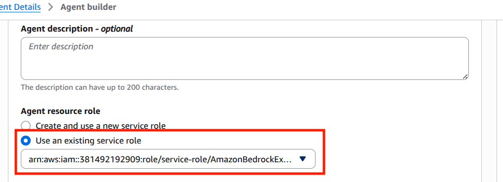

# Cấu Hình Chi Tiết AI Agent trên AWS Bedrock

## Tổng Quan

Ở phần trước, đã tạo thành công **2 Knowledge Bases**. Sang phần này, chúng ta sẽ cấu hình chi tiết các tính năng cho AI Agent để tạo thành một **Agent cơ bản hoàn chỉnh**.

### **Các Tính Năng Sẽ Cấu Hình:**

1. ✅ **Agent Role** - IAM role cho phép Agent thực hiện hành động
2. ✅ **Model LLM** - Chọn mô hình AI phù hợp
3. ✅ **Instructions** - Hướng dẫn hành vi Agent
4. ✅ **Knowledge Bases** - Kết nối 2 Knowledge Bases
5. ✅ **Guardrails** - Bảo vệ Agent khỏi xử lý không an toàn
6. ✅ **Action groups** - Cấu hình các Tools/Actions mà Agent có thể gọi

---

## Hướng Dẫn Chi Tiết Từng Cấu Hình

### **Bước 0️⃣: Vào Agent Builder**

#### **Các Bước:**

1. **Truy Cập AWS Bedrock Console**
   ```
   URL: https://console.aws.amazon.com/bedrock
   Menu: Build → Agents
   ```

2. **Chọn Agent Vừa Tạo**
   ```
   Tìm: "agent-demo-workshop"
   Click vào agent này
   ```

3. **Bấm "Edit in Agent Builder"**
   ```
   Nút: "Edit in Agent Builder" (góc phải trên)
   Hoặc: Vào chi tiết agent → Tab "Edit"
   
   Giao diện Agent Builder sẽ mở ra
   ```

4. **Giao Diện Agent Builder**
   ```
   Hiển thị:
   • Agent name ở trên cùng
   • Menu bên trái (Settings, Instructions, ...)
   • Main content area (Edit fields)
   • Save button (góc phải trên)
   ```

---

## 1️⃣ Cấu Hình Agent Role

### **Agent Role Là Gì?**

**Định nghĩa:**
```
Agent Role = IAM Role cho phép Agent thực hiện actions
• Truy cập S3 buckets
• Gọi Lambda functions
• Truy cập databases
• Gửi emails
• Cập nhật records
```

**Tại Sao Cần?**
```
✅ Security: Kiểm soát quyền của Agent
✅ Isolation: Agent chỉ có quyền cần thiết
✅ Audit: Theo dõi Agent actions
✅ Governance: Tuân thủ policies
```

### **Hướng Dẫn Cấu Hình Role**



#### **Các Bước:**

1. **Vào Settings Tab**
   ```
   Menu trái: Settings (hoặc Overview)
   Hoặc: Tìm section "Agent configuration"
   ```

2. **Tìm Field "IAM Role" (hoặc "Agent Execution Role")**
   ```
   Field: "IAM role for agent execution"
   Hiện tại: [Default role hoặc không chọn]
   ```

3. **Bấm Dropdown hoặc "Change Role"**
   ```
   Nút: Dropdown "Select IAM role"
   Danh sách role sẽ hiện ra
   ```

4. **Tìm Và Chọn Role Chính Xác**
   ```
   Tìm: "AmazonBedrockExecutionRoleForAgents_CSZ8RZ6GK66"
   
   Hoặc:
   • AmazonBedrockExecutionRole*
   • BedrockAgent*
   • Bất kỳ role có "Bedrock" trong tên
   
   Click chọn role này
   ```

***Tiếp theo***: Cấu hình LLM Model [phần tiếp theo](3.4.Bedrock-model.md)
