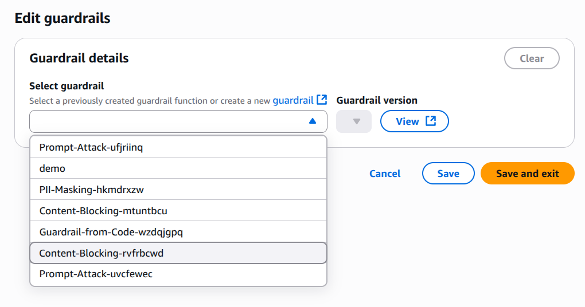

## 5️⃣ Cấu Hình Guardrails



### **Guardrails Là Gì?**

**Định nghĩa:**
```
Guardrails = Bảo vệ an toàn cho Agent
• Content filtering
• Jailbreak prevention
• PII (Personally Identifiable Info) protection
• Harmful content detection
• Policy enforcement
```

### **Các Loại Guardrails**

```
1️⃣ Content Filtering
   • Ngôn ngữ không thích hợp
   • Tội phạm/bạo lực
   • Hate speech
   • Adult content

2️⃣ PII Protection
   • Không tiết lộ email
   • Không tiết lộ phone numbers
   • Không tiết lộ SSN
   • Không tiết lộ credit cards

3️⃣ Custom Policies
   • Company-specific rules
   • Industry regulations
   • Business logic
   • Custom constraints

4️⃣ Harmful Content Detection
   • Phishing attempts
   • Malware distribution
   • Scams
   • Misinformation
```
---
**Nếu bạn muốn tìm hiểu sâu hơn về Guardrails khi triển khai AI Agent trên nền tảng Amazon Bedrock thì có thể tham khảo tại [đây](https://catalog.us-east-1.prod.workshops.aws/workshops/0720c7c4-fb23-4e43-aa9f-036fc07f46b2/en-US)

***Tiếp theo***: Cấu hình Tools/Actions trên Bedrock [phần tiếp theo](3.8.Bedrock-tools.md)