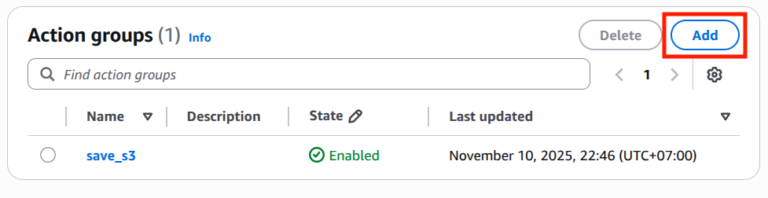
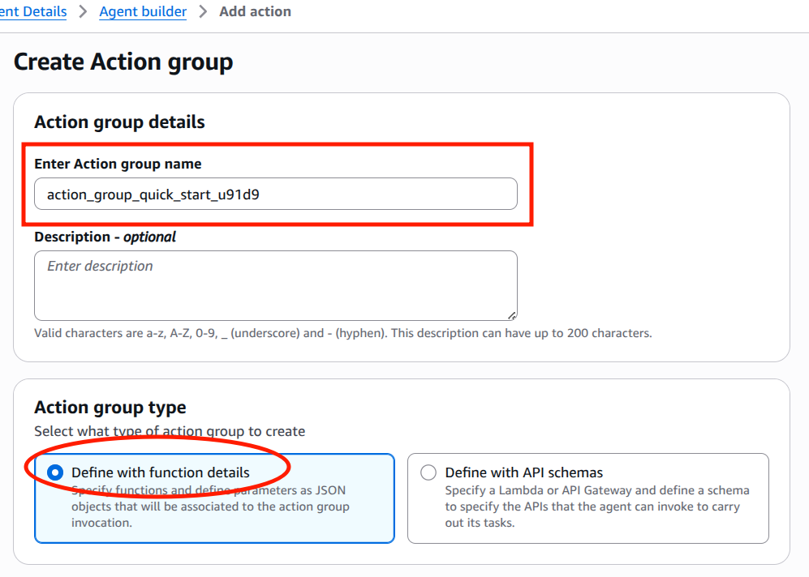
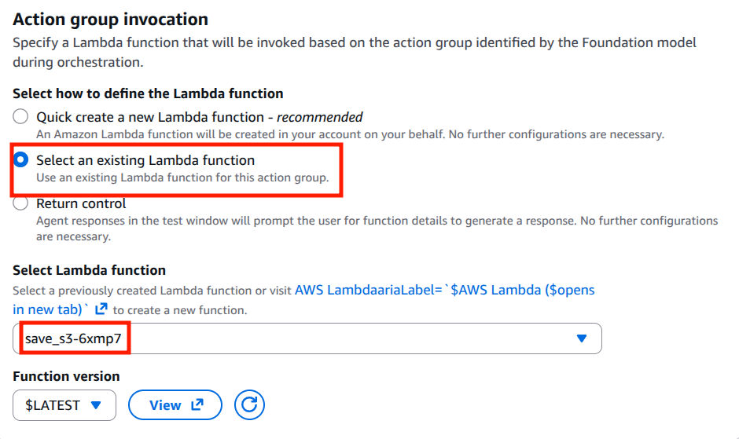
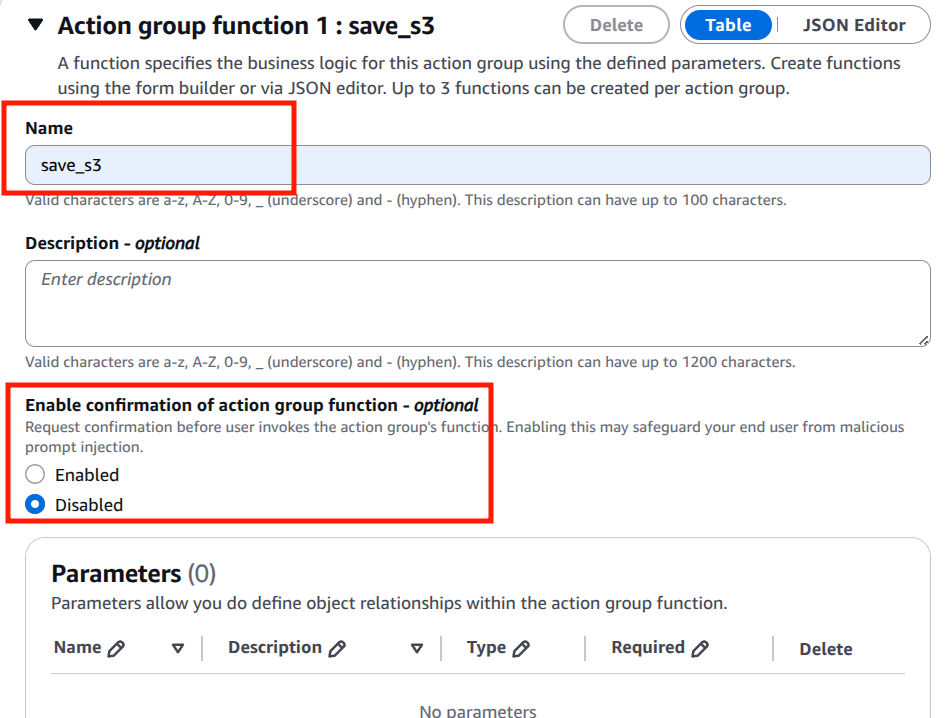
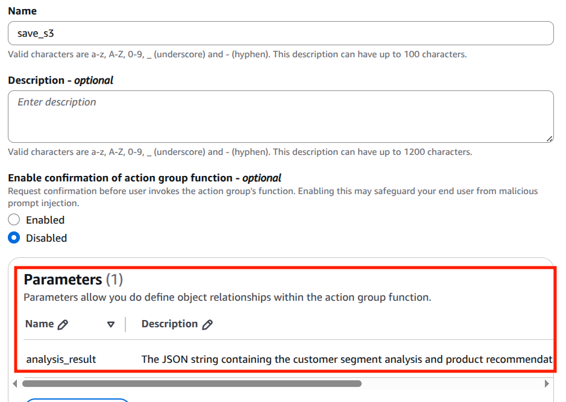

## 6️⃣ Cấu Hình Action Groups (Tools)

### **Action Groups Là Gì?**

**Định nghĩa:**
```
Action Groups = Tập hợp các Tools/Actions mà Agent có thể gọi
• Lambda functions
• API integrations
• Database queries
• External services
• Custom logic
```

### **So Sánh: Không Có vs Có Action Groups**

**❌ Không Có Action Groups:**
```
User: "Gửi email khuyến nghị cho customer 123"

Agent: "Dựa trên dữ liệu, tôi khuyên gửi email như sau:
  Subject: Recommended Products
  Body: ...
  
  (Chỉ tạo draft text, không thực sự gửi)"
```

**✅ Có Action Groups:**
```
User: "Gửi email khuyến nghị cho customer 123"

Agent: 
  1. Lấy customer profile (Tool: GetCustomerProfile)
  2. Lấy recommended products (Tool: GetRecommendations)
  3. Soạn email (LLM generates content)
  4. Gửi email (Tool: SendEmail)
  5. Cập nhật tracking (Tool: UpdateTracking)
  
  → Email thực sự được gửi!
```

### **Action Groups Architecture**

```
┌─────────────────────────────────────────┐
│         AI Agent (LLM)                  │
│  "Gợi ý sản phẩm cho customer 123"     │
└────────────────┬────────────────────────┘
                 │
                 ▼
     ┌───────────────────────┐
     │  Action Groups        │
     │  (Orchestrator)       │
     └───┬───┬───┬───┬───┬───┘
         │   │   │   │   │
    ┌────▼┐┌─▼───┐┌──▼──┐┌─▼────┐┌─▼────┐
    │Get  ││Get  ││Send ││Update││Log   │
    │Cust ││Recom││Email││Cust  ││Inter │
    │Data ││mend ││     ││Profile││action
    └────┬┘└──┬──┘└──┬──┘└──┬───┘└──┬───┘
         │    │      │      │      │
         ▼    ▼      ▼      ▼      ▼
       [Database] [API] [Email] [CRM]
```

### Hướng Dẫn Chi Tiết: Tạo Action Groups

#### Bước 1: Khởi Tạo Action Groups
Trên giao diện Agent Builder, nhấn nút **Add** để bắt đầu tạo một Action Group mới.



#### Bước 2: Cấu Hình Thông Tin Cơ Bản
Nhập tên cho Action Group của bạn. Trong phần **Action Group Type**, chọn **"Define with function details"** để cấu hình chi tiết các tham số.



#### Bước 3: Liên Kết Lambda Function
Trong phần **Action Group Invocation**, thực hiện các bước sau:
- Chọn **"Select an existing Lambda function"**
- Tìm và chọn Lambda function mà bạn đã chuẩn bị để xử lý việc lưu kết quả phân tích từ AI Agent xuống AWS S3



#### Bước 4: Đặt Tên Function
Trong phần **Action Group Function 1**:
- Đặt tên có ý nghĩa cho hàm (ví dụ: `save_s3`)
- Nếu muốn AI Agent xác nhận với người dùng trước khi thực thi hành động, hãy bật tùy chọn **"Enable confirmation of action group function"**



#### Bước 5: Định Nghĩa Parameters
Thêm các tham số (Parameters) cho Function. Các tham số này sẽ định nghĩa những biến mà AI Agent sẽ sử dụng để truyền dữ liệu cho hàm Lambda.

**Ví dụ Parameter:**
```
Tên: analysis_result
Mô tả: Chuỗi JSON chứa kết quả phân tích segment khách hàng và gợi ý sản phẩm
Kiểu dữ liệu: array
Bắt buộc: Không
```



#### Bước 6: Lưu và Kết Thúc
Sau khi hoàn tất cấu hình, nhấn **"Save and exit"** để hoàn thành tạo Action Group.

#### Bước 7: Cập Nhật Agent
Quay trở lại giao diện Agent Builder:
- Nhấn **"Save"** để lưu các thay đổi
- Nhấn **"Prepare"** để chuẩn bị Agent với cấu hình mới

Agent giờ đã sẵn sàng để kiểm thử với Action Groups mới được tạo.

***Tiếp theo***: Kiểm thử AI Agent trên giao diện của Bedrock [phần tiếp theo](3.9.Bedrock-test.md)