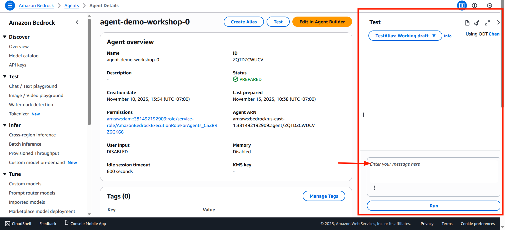
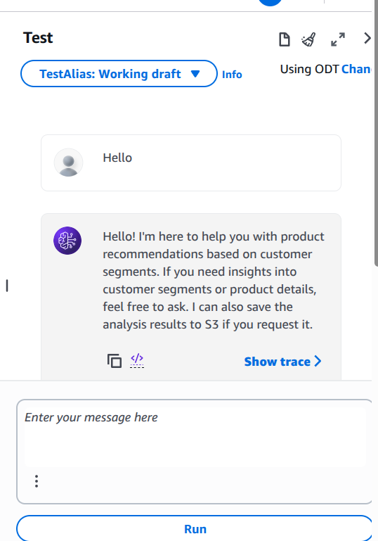

# 🧪 Kiểm Thử AI Agent

## Tổng Quan

Sau khi hoàn tất cấu hình AI Agent với các Action Groups, bước tiếp theo là **kiểm thử chức năng** để đảm bảo Agent hoạt động đúng như dự kiến. AWS Bedrock cung cấp một giao diện kiểm thử trực tuyến (Chatbot) cho phép bạn tương tác trực tiếp với Agent mà không cần viết code.

---

## Giao Diện Kiểm Thử

### Truy Cập Giao Diện Chat
Trên giao diện Agent Builder của AWS Bedrock, phía bên phải màn hình là **giao diện Chat Playground**. Đây là không gian cho phép bạn:
- ✅ Gửi các câu hỏi và yêu cầu đến AI Agent
- ✅ Theo dõi phản hồi của Agent theo thời gian thực
- ✅ Kiểm tra các Action Groups được gọi
- ✅ Xác nhận các hành động trước khi thực thi



---

## Quy Trình Kiểm Thử

### Các Câu Lệnh Kiểm Thử Được Khuyến Nghị

**Câu 1 - Thiết Lập Ngữ Cảnh (Greeting):**
```
Hello
```
*Mục đích:* Kiểm tra xem Agent có phản hồi và hiểu ngôn ngữ không.

**Câu 2 - Yêu Cầu Chính (Main Task):**
```
Analyze all customer segments and recommend 3-5 suitable products for each segment.
```
*Mục đích:* Yêu cầu AI Agent thực hiện phân tích RFM segments và đưa ra gợi ý sản phẩm. Đây là nhiệm vụ core của Agent.

**Câu 3 - Lưu Trữ Kết Quả (Action Execution):**
```
Save the results to S3.
```
*Mục đích:* Kiểm tra xem Action Groups có được gọi đúng cách để lưu kết quả phân tích xuống AWS S3 không.

---

## Theo Dõi Kết Quả Kiểm Thử

### Giao Diện Chat Playground


### Các Chỉ Tiêu Kiểm Thử Thành Công
Để xác nhận Agent hoạt động chính xác, hãy kiểm tra:

1. **Phản Hồi Tự Nhiên (Natural Response)**
   - Agent phản hồi những câu hỏi của bạn một cách mạch lạc
   - Câu trả lời phải liên quan đến ngữ cảnh (segments, products recommendations)

2. **Gọi Action Groups Đúng Cách**
   - Agent có gọi Lambda function để lưu kết quả không?
   - Có xác nhận hành động trước khi thực thi (nếu bạn bật tùy chọn này)?

3. **Lưu Dữ Liệu Thành Công**
   - Kiểm tra AWS S3 bucket để xác nhận tệp kết quả đã được lưu
   - Xem log từ Lambda function để phát hiện lỗi (nếu có)

4. **Xử Lý Lỗi**
   - Agent có thông báo lỗi rõ ràng nếu có vấn đề không?
   - Có gợi ý giải pháp hoặc bước tiếp theo không?

---

## Mẹo & Khắc Phục Sự Cố

| Vấn Đề | Nguyên Nhân | Giải Pháp |
|--------|-----------|----------|
| Agent không phản hồi | Model LLM chưa được prepare | Nhấn "Prepare" để cập nhật cấu hình |
| Action Group không được gọi | Tên function không khớp | Kiểm tra lại tên Lambda function |
| Lỗi lưu S3 | IAM role không có quyền | Cập nhật trust policy của Lambda role |
| Kết quả bị cắt ngắn | Output quá dài | Giảm kích thước dữ liệu hoặc chia nhỏ |

---

## Kết Luận

🎉 **Chúc mừng!** Bạn đã hoàn thành toàn bộ bài lab sử dụng các dịch vụ AWS tiên tiến:

### Những Gì Bạn Đã Học:
✅ **Amazon SageMaker:** Phân tích dữ liệu RFM và phân cụm K-Means  
✅ **AWS Bedrock:** Xây dựng AI Agent với khả năng tự động hóa  
✅ **Action Groups:** Tích hợp Lambda functions để thực thi hành động  
✅ **End-to-End Workflow:** Từ phân tích dữ liệu đến tự động hóa quyết định kinh doanh

### Ứng Dụng Thực Tế:
- 🎯 Phân khúc khách hàng tự động
- 💡 Gợi ý sản phẩm được cá nhân hóa
- 📊 Tạo báo cáo phân tích nhanh chóng
- 🤖 Tự động hóa quy trình marketing

### Bước Tiếp Theo:
Bây giờ bạn có thể mở rộng project này bằng:
- Thêm nhiều Action Groups phức tạp hơn
- Tích hợp với các dịch vụ AWS khác (Lambda, DynamoDB, SNS)
- Xây dựng giao diện web frontend
- Triển khai trong môi trường production

---

**Cảm ơn đã hoàn thành bài lab! 🚀**